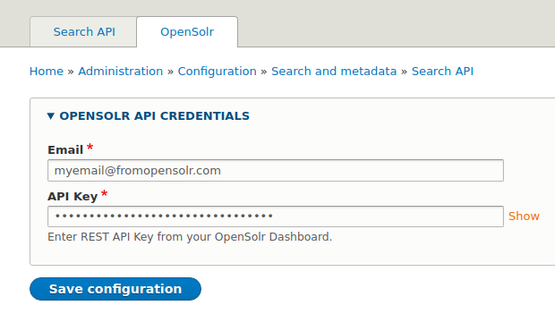
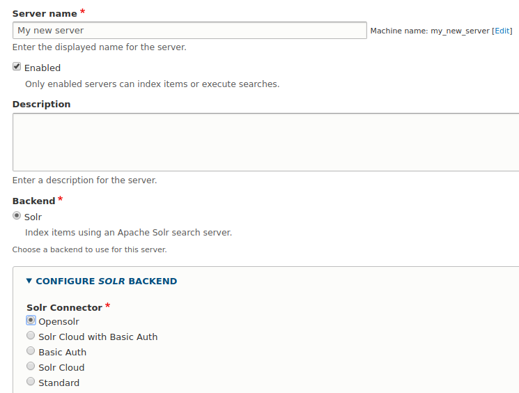
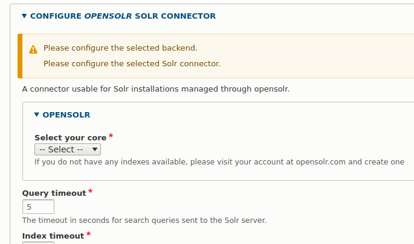

# Search API opensolr

Extends the main Search API Solr module and provides functionality for 
connecting and managing solr services using [opensolr](https://opensolr.com) 
services.

## Installation

Assuming that your site is
[managed via Composer](https://www.drupal.org/node/2718229), use composer to
download the module. The following command will fetch the latest version.

````
composer require drupal/search_api_opensolr
````

If you want to download a specific version or a different rule for version, 
check the guide on how to manage versions with composer.

If you are somehow not using composer based site, download the module from the 
[module page](https://www.drupal.org/project/search_api_opensolr) and place the
contents of it in the modules/contrib folder.

## Enabling the module

You can manually enable the module from the **Extend** administration menu or
by simply running the drush command below. 

````
drush en search_api_opensolr
````

## Configuration

This module provides two configuration areas which depend on each other.

#### Setting the API credentials

Without this configuration correctly set, you will not be able to add a server 
and use any of the features provided by this module.

Go to **Configuration → Search and Metadata → Search API → OpenSolr** and enter 
you [opensolr](https://opensolr.com) email and API key (which can be found in 
your Dashboard) and save.



If your data is correct, then you will receive a confirmation message saying 
that the [opensolr](https://opensolr.com) services were successfully reached. 
Otherwise, you will get an error message and you will not be able to set your 
values until you get the success message.

#### Adding your server

Once the API Credentials are ready, you can add your server.

Go to **Configuration → Search and Metadata → Search API** and press the 
**Add Server** button.

Enter a server name and from the **Configure SOLR backend / Solr Connector** 
section, select **Opensolr**. 



Once you select the option, you should be presented with the OpenSolr settings 
form and the defaults from search api. The only thing you need to do is to 
choose the core from your [opensolr](https://opensolr.com) account from the 
select list. If you do not have any cores in the select list, please check your 
[opensolr](https://opensolr.com) account.



Save your settings and you should have the server up and running.

@todo: Further documentation will be added once the module is updated. Regarding
the configuration files, please follow the instructions from 
[opensolr](https://opensolr.com) till we add more info.

---
See full documentation [here](https://www.drupal.org/docs/8/modules/search-api-opensolr).
